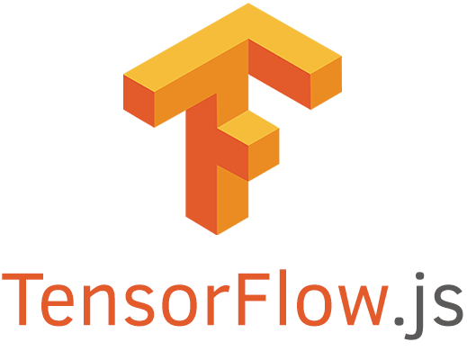

# Universal Machine Learning
_Make machine learning and machine learning education accessible to all people regardless of socioeconomic circumstances._

# Overview

Without a doubt, machine learning can be an expensive undertaking, especially in the context of training neural networks. Complex models can take an immense amount of computing power to train. For those with __severely__ limited access to computing power, even the "simplest" models can be difficult or impossible to compute locally. 

While services like GCP and AWS exist to provide additional computing power, it's reasonable to assume that someone with especially low resources might not be able to afford these services in the long run. Additionally, the "free plans" for these platforms are still limited in features. For example, the _Always Free_ Tier on GCP, doesn't allow users to use GPU's or TPU's for free.

The goal of this project is to provide a platform for "universal machine learning". Users of the platform can harness the power of computers provided by those fortunate enough to have access to powerful devices. Free of charge. Our service provides an easy-to-use web app integrated with Tensorflow.js that allows users to train and test models in a web interface. The target audience of this platform is twofold:

1. Those in the beginning stages of their machine learning education who may have limited or no coding skills.

2. Those with programming skills but severely limited access to compute power.

For the former, we provide an easy-to-use interface for testing and tuning models without using any code. For example, users can experiment with a simple feed-forward neural network by adjusting the number of hidden layers and their parameters (# of units, activation function).

For the latter, TensorFlow.js allows more experienced users to write models themselves using 2 methods:

1. Using Keras via the Python API. Users can write and compile `Sequential` models as they normally would and save them to the `.h5` format. Tensorflow.js then provides tools to convert `.h5` files into the Tensorflow.js "Layers format" which consists of:

* A `.json` file containing the topology/architecture of model

* A file in binary format containing the weights of the model (Tensorflow.js also allows you to load already-trained models)

2. Alternatively, users can save and upload their model by directly writing it locally in Tensorflow.js and uploading the `.json` and binary files without any conversion.

Users can then train/validate/test their models as they usually would through the interface.

# Technical Details
